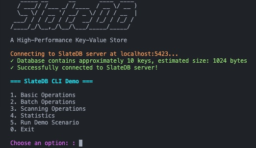

# SlateDB Fancy CLI Demo

This is a fancy command-line interface (CLI) demo for SlateDB, showcasing its capabilities with a colorful and interactive interface.

## Features

- Interactive menus for all SlateDB operations
- Colorful output with clear visual indicators
- Tabular display of key-value data
- Comprehensive demo scenario that showcases all features
- Support for basic, batch, and scanning operations

## Prerequisites

- Go 1.16 or higher
- A running SlateDB server (default: localhost:8080)

## Installation

```bash
# Install dependencies
go get github.com/fatih/color github.com/rodaine/table

# Build the CLI
go build -o slatedb-cli
```

## Usage

To run the SlateDB Fancy CLI:

```bash
go run main.go
```

### Environment Variables

The CLI supports the following environment variables:

- `SERVER_ADDR`: The address of the SlateDB server (default: "localhost:5423")

Example:

```bash
SERVER_ADDR=localhost:8080 go run main.go
```

## Demo Scenario

The demo scenario showcases the following operations:

1. Clearing existing demo data
2. Inserting sample data (users, products, orders)
3. Retrieving all data with prefix scan
4. Retrieving specific data categories
5. Getting database statistics
6. Deleting specific keys
7. Verifying deletions
8. Performing range scans

## Screenshots



## Available Operations

### Basic Operations

- Put: Store a key-value pair
- Get: Retrieve a value by key
- Delete: Remove a key-value pair

### Batch Operations

- Batch Put: Store multiple key-value pairs
- Batch Get: Retrieve multiple values by keys
- Batch Delete: Remove multiple keys

### Scanning Operations

- Prefix Scan: Find all keys with a specific prefix
- Range Scan: Find all keys within a specific range

### Statistics

- Get database statistics (key count, size, etc.)
